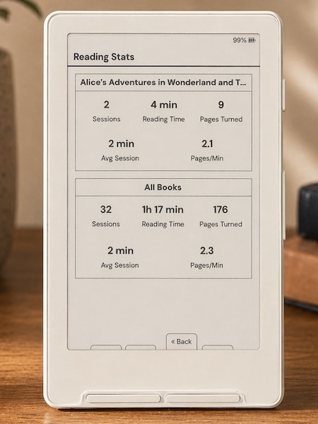
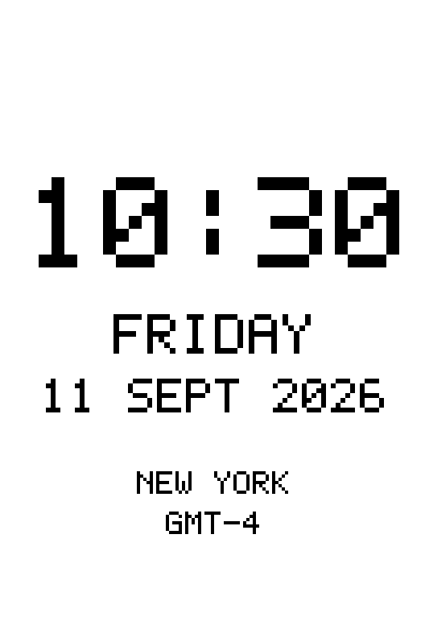
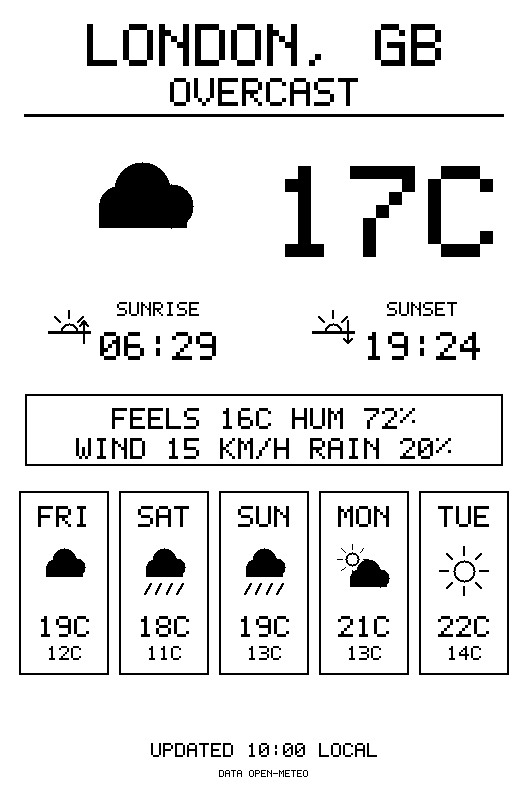
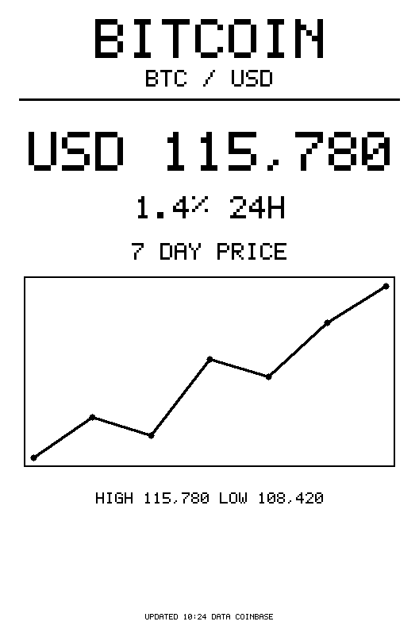
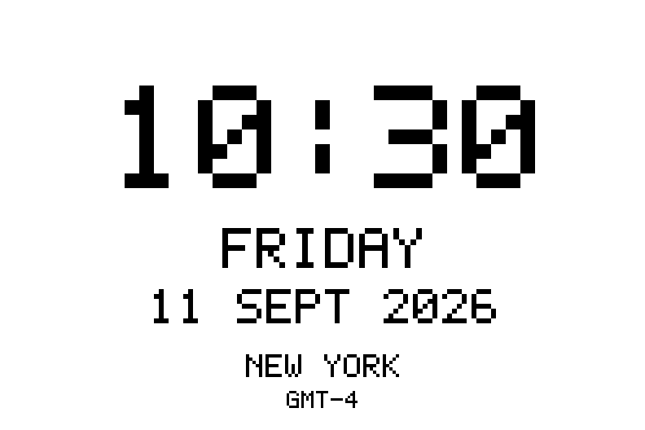
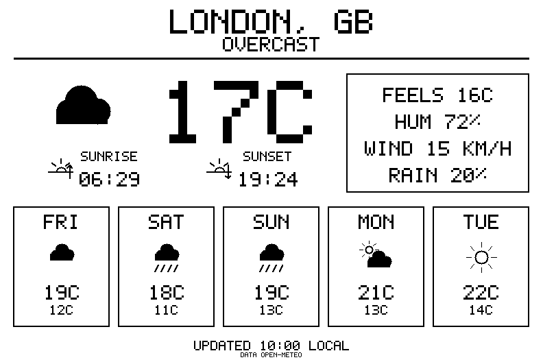
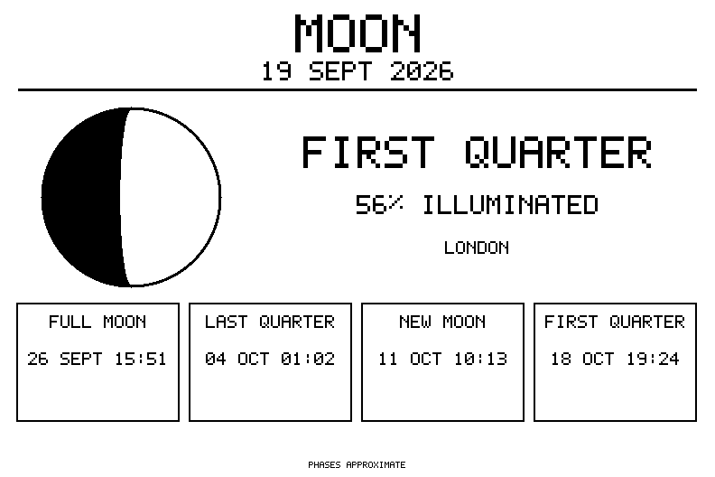
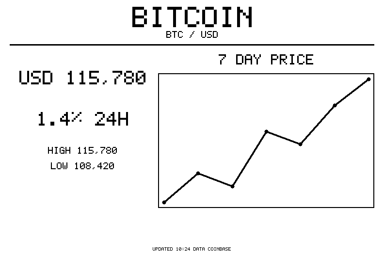
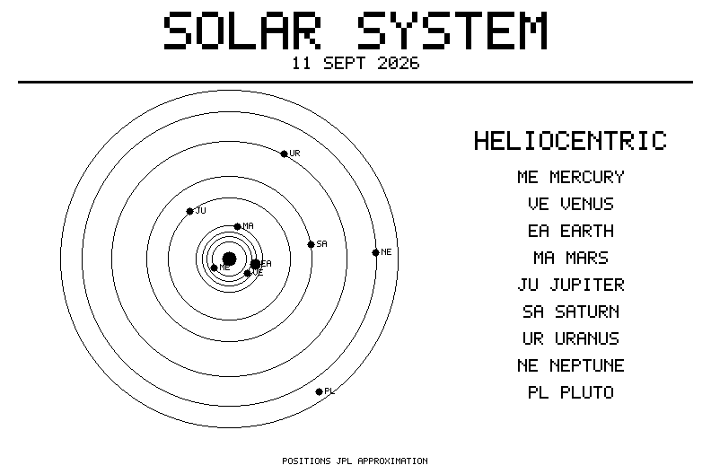

# CrossInk Cards

> A customized firmware fork combining the refined typography and reading statistics of **[CrossInk](https://github.com/uxjulia/CrossInk)** with the dynamic always-on e-ink display capabilities of **[CrossPoint Cards](https://github.com/petereading/crosspoint-cards)**.

Designed and tuned specifically for the **Xteink X3** (and compatible with X4, X4 Pro, X4 Classic, and Seeed Studio Sticky).

<table>
  <tr>
    <td align="center" width="33%">
      <br/>
      <em>Always-on Card Display</em>
    </td>
    <td align="center" width="33%">
      <br/>
      <em>Bitter Slab-Serif Typography</em>
    </td>
    <td align="center" width="33%">
      <br/>
      <em>Reading Stats Dashboard</em>
    </td>
  </tr>
</table>

---

## Highlights

### 🃏 Dynamic Cards System
- **Always-on Display Mode:** Open any card from **Main Menu → Cards** to keep it continuously rendered on screen with the WiFi radio completely powered down between intervals.
- **Card Sleep Screen:** Set **Settings → Display → Sleep Screen** to *Card* and select your preferred slot (*Card 1* through *Card 6*). The reader enters deep sleep, wakes up on a precision hardware timer, updates the card over WiFi, and returns to sleep while maintaining the image on the EPD panel.
- **6 Independent Slots:** Each slot holds a custom HTTPS URL and its own discrete refresh interval (1, 2, 5, 10, 15, 30, 60, 120, or 240 minutes) aligned to wall-clock boundaries.
- **Resilient Refreshes:** Images are validated in memory before writing to the display. If a network fetch fails, the last good card remains on screen instead of blanking out.
- **Optimized for ESP32-C3:** Low-memory WolfSSL transport prevents heap exhaustion during TLS handshakes on devices without PSRAM.

### 📖 Refined Reader & Typography
- **Handpicked Fonts:** Built-in **Bitter** (contemporary slab-serif, consistent stroke weights for crisp e-ink rendering) and **Lexend Deca** (research-backed sans-serif designed for reading fluency), plus Inter for display UI.
- **Reader Font Sizes:** 10 pt, 12 pt, 14 pt, and 16 pt with anti-aliasing.
- **Expanded Glyphs:** Music notation, selected Cyrillic characters, and Project Hail Mary CJK glyph support.
- **Reading Stats:** Tracks total books read, total reading time, sessions, pages turned, average session duration, and pages per minute. Sync reading stats or reading progress between devices.
- **Focused Modes:** Focus Reading, Guide Dots, Force Paragraph Indents, and quick in-book adjustment menus.
- **Custom Button Mappings:** Extensive button shortcuts for power button short/long presses, front buttons, and a configurable Quick Actions radial menu.

---

## The Cards Feature

A card is an HTTPS endpoint serving a 1-bit monochrome BMP formatted for the reader's display resolution. The firmware fetches the bitmap, validates the headers, renders it to the screen, and sleeps until the next scheduled interval.

### The Eight Built-in Cards

`examples/cloudflare-dashboard-worker.js` provides a self-contained Cloudflare Worker that renders eight pre-designed cards in both portrait and landscape orientations.

<table>
  <tr>
    <td width="25%"></td>
    <td width="25%"></td>
    <td width="25%"></td>
    <td width="25%"></td>
  </tr>
  <tr>
    <td align="center"><b>clock</b></td>
    <td align="center"><b>weather</b></td>
    <td align="center"><b>moon</b></td>
    <td align="center"><b>today</b></td>
  </tr>
  <tr>
    <td></td>
    <td></td>
    <td></td>
    <td></td>
  </tr>
  <tr>
    <td align="center"><b>quote</b></td>
    <td align="center"><b>bitcoin</b></td>
    <td align="center"><b>solar</b></td>
    <td align="center"><b>astro</b></td>
  </tr>
</table>

- **`/clock.bmp`** — Clean digital clock with day and date. Supports `location=NYC` or any IANA timezone with automatic DST calculation. Supports `lead` (render ahead) and `round` parameters so the displayed time matches the exact moment it finishes rendering.
- **`/weather.bmp`** — Current temperature, feels-like, humidity, wind, precipitation chance, sunrise/sunset, and a 5-day forecast strip via Open-Meteo. Supports `location=London,GB`, coordinates (`lat`/`lon`), or `location=auto`.
- **`/moon.bmp`** — Illuminated lunar phase fraction calculated against US Naval Observatory data, with upcoming quarter phase dates.
- **`/today.bmp`** — Historical events on this day from Wikipedia. Supports language editions (e.g. `lang=en`, `lang=de`).
- **`/quote.bmp`** — Daily curated quote from Wikiquote with automatic text flow.
- **`/bitcoin.bmp`** — Live BTC/USD price, 24-hour delta, and 7-day sparkline chart via Coinbase.
- **`/solar.bmp`** — Heliocentric planetary positions computed locally from JPL Keplerian orbital elements without external API dependencies.
- **`/astro.bmp`** — Astrological natal/transit wheel chart with Placidus, whole, or equal house divisions and configurable aspect orbs.

#### Landscape Orientation Support

Each card layout automatically reformats itself when requested in landscape mode rather than merely rotating the image:

<table>
  <tr>
    <td width="50%"></td>
    <td width="50%"></td>
  </tr>
  <tr>
    <td></td>
    <td></td>
  </tr>
  <tr>
    <td></td>
    <td></td>
  </tr>
  <tr>
    <td></td>
    <td></td>
  </tr>
</table>

---

## Deploying the Cloudflare Worker

You can deploy the cards renderer to your free Cloudflare Workers account in minutes:

### Option A: Via Wrangler CLI

```bash
npm install -g wrangler
wrangler login

mkdir -p cards/src && cd cards
cp /path/to/crossink-cards/examples/cloudflare-dashboard-worker.js src/index.js
```

Create a `wrangler.toml` file:

```toml
name = "cards"
main = "src/index.js"
compatibility_date = "2025-01-01"
```

Deploy the worker:

```bash
wrangler deploy
```

### Option B: Cloudflare Web Dashboard

1. Navigate to **Workers & Pages → Create Application → Create Worker**.
2. Paste the contents of [`examples/cloudflare-dashboard-worker.js`](./examples/cloudflare-dashboard-worker.js) into the online code editor.
3. Click **Deploy**.

Your cards endpoint will be available at `https://cards.<your-subdomain>.workers.dev`. Visiting the root URL in your browser displays the full parameter documentation and available location codes.

---

## Configuring Card Slots

You can configure card URLs and intervals either over the local web interface or on the device itself:

1. **Via Web Interface (Recommended):**
   - Connect the reader to your local network under **Settings → System → WiFi**.
   - Open the displayed IP address in your computer or phone browser.
   - Go to **Settings → Cards** and paste your card URLs and select refresh intervals for slots 1 through 6.
2. **On Device:**
   - Go to **Main Menu → Cards** and select a slot to input or edit the URL using the on-screen keyboard.
   - Adjust refresh intervals under **Settings → System → Card X Refresh** or **Settings → Display → Sleep Screen**.

---

## Over-The-Air (OTA) Updates

Firmware updates are automatically fetched from this repository's releases:
- Go to **Settings → System → Check for updates**.
- The device connects to WiFi, checks `paletochen/crossink-cards` releases on GitHub, and prompts you to install when a new version or build is found.

---

## Installation & Flashing

Precompiled binaries are built automatically on every commit and release in GitHub Actions:

1. Download the latest `firmware.bin` or `crossink-cards_firmware.bin` from the [Releases](https://github.com/paletochen/crossink-cards/releases) page.
2. Flash using the [CrossPoint Web Installer](https://crosspointreader.com) or [Inky Web Companion](https://inky.crossink.dev/#flash-tools).
3. Alternatively, copy the binary to your SD card and flash from the device under **Settings → System → SD Firmware Update**.

---

## Building from Source

This project uses [PlatformIO](https://platformio.org) with the `pioarduino` core:

```bash
# Clone repository with submodules (using standard files ref format for ESP-IDF CMake compatibility)
git clone --recursive https://github.com/paletochen/crossink-cards.git
cd crossink-cards

# If your git defaults to reftables (e.g. gLinux/Google machines), migrate refs to files:
# git refs migrate --ref-format=files

# Build default firmware (Xteink X3 / X4)
pio run -e default

# Build and flash to USB-connected device
pio run -e default --target upload
```

---

## License & Acknowledgments

- Based on **[CrossInk](https://github.com/uxjulia/CrossInk)** by Julia and contributors.
- Cards engine and Cloudflare worker adapted from **[CrossPoint Cards](https://github.com/petereading/crosspoint-cards)** by Peter Reading.
- Upstream core reader software provided by the **[CrossPoint Reader](https://github.com/crosspoint-reader/crosspoint-reader)** project.
- Licensed under the [MIT License](./LICENSE). CrossInk Cards is an independent open-source project and is not affiliated with Xteink or any hardware manufacturer.
